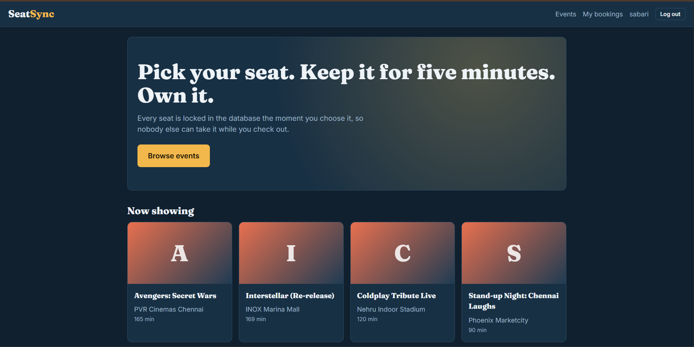
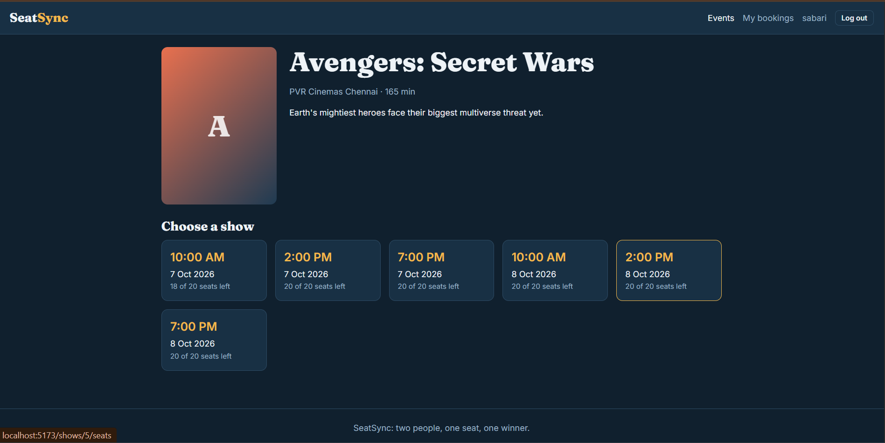
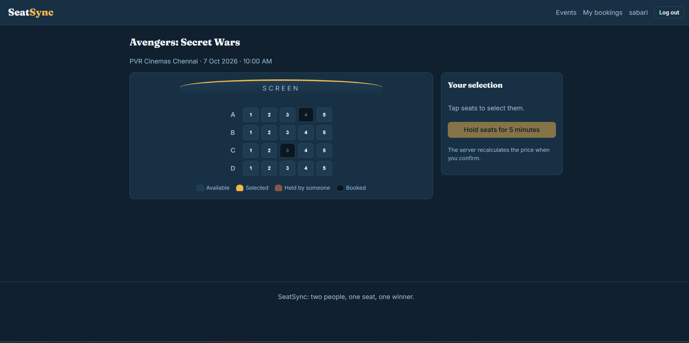
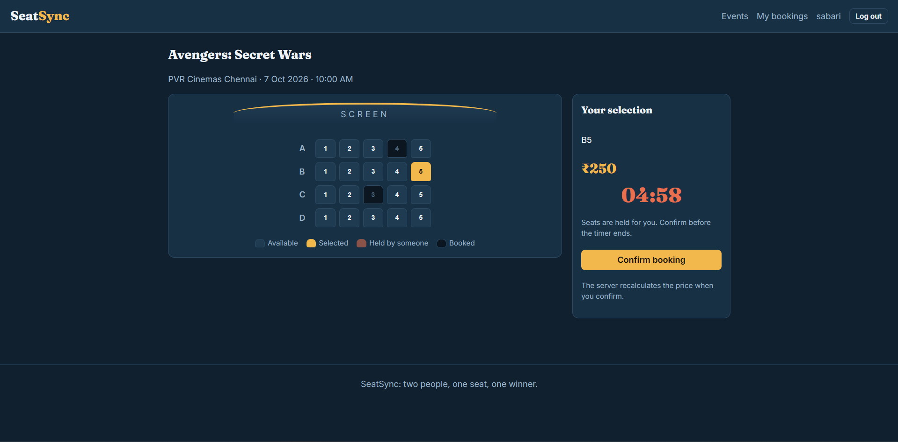
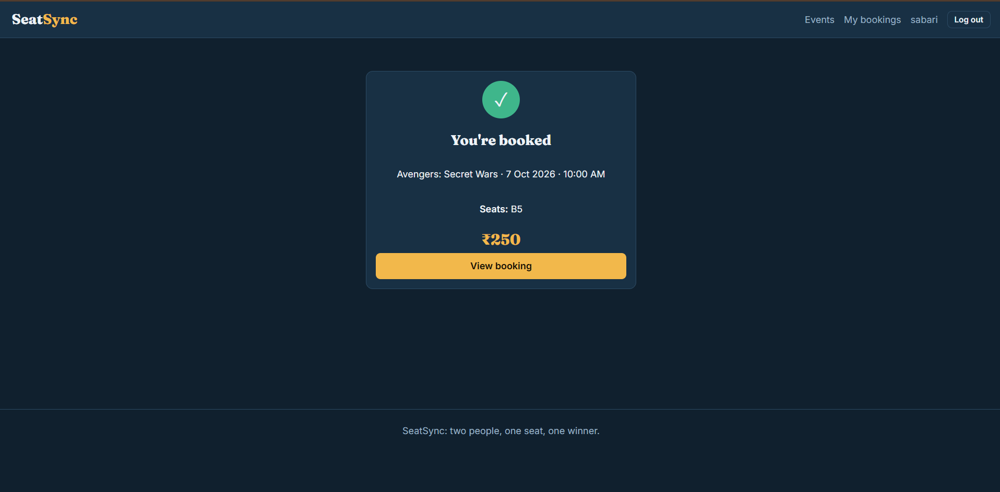
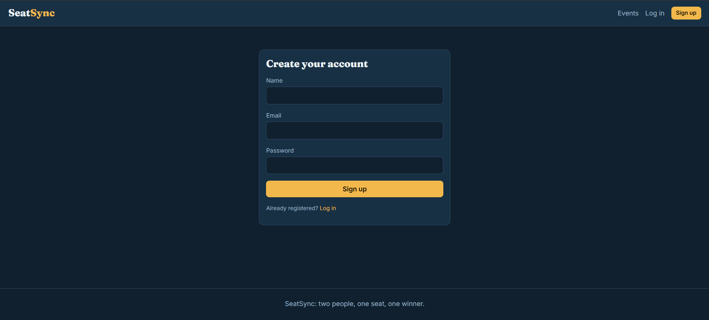

# SeatSync

SeatSync is a React and Vite seat-booking application. Users can browse events, choose a show, select seats, hold seats for five minutes, confirm a booking, and view their bookings. Administrators can manage events, shows, users, and bookings.

## Features

- User registration, login, logout, and profile access
- Event listing and event details
- Show selection with date, time, venue, and seat availability
- Interactive seat selection
- Five-minute seat holds before confirmation
- Booking confirmation and booking history
- Admin dashboard for events, shows, users, and booking status
- Protected customer and admin routes
- Axios API client with JWT token handling

## Technology

- React 18
- Vite 5
- React Router
- Axios
- JavaScript
- CSS

## Requirements

Install these before running the project:

- Node.js 18 or newer
- npm 9 or newer
- The SeatSync backend API running locally or hosted remotely

## Download and run on another laptop

### 1. Install Git and Node.js

Install Git and Node.js from their official websites, then confirm that they are available:

```bash
git --version
node --version
npm --version
```

### 2. Clone the repository

```bash
git clone https://github.com/Sabarii27/SeatSync-Booking-System.git
cd SeatSync-Booking-System
```

If the repository contains the frontend in a subfolder, enter that folder before installing dependencies:

```bash
cd seatsync-frontend
```

### 3. Install dependencies

```bash
npm install
```

### 4. Configure the backend URL

The frontend uses this API URL by default:

```text
http://localhost:8080/api
```

To use a different backend, create a `.env` file in the frontend project folder:

```env
VITE_API_URL=http://localhost:8080/api
```

For a hosted backend, replace the value with its public API URL. Restart the Vite server after changing `.env`.

### 5. Start the development server

```bash
npm run dev
```

Open the URL shown in the terminal, normally:

```text
http://localhost:5173
```

The backend must be running for login, events, seat availability, and bookings to work.

## Available commands

| Command | Purpose |
| --- | --- |
| `npm run dev` | Start the local development server |
| `npm run build` | Create a production build in `dist` |
| `npm run preview` | Preview the production build locally |

## Application routes

### Public routes

- `/` - Home page
- `/events` - Browse events
- `/events/:id` - Event details and shows
- `/login` - Sign in
- `/register` - Create an account

### Customer routes

- `/shows/:showId/seats` - Select and hold seats
- `/booking-success/:id` - Booking confirmation
- `/my-bookings` - View bookings
- `/bookings/:id` - View booking details
- `/profile` - View profile

### Admin routes

Admin access depends on the authenticated user's role:

- `/admin` - Admin dashboard
- `/admin/events` - Manage events
- `/admin/events/:id/shows` - Manage shows
- `/admin/bookings` - Manage bookings
- `/admin/users` - View users

## Typical user flow

1. Register or log in.
2. Open **Events** and choose an event.
3. Select a showtime.
4. Choose an available seat.
5. Hold the seat for five minutes.
6. Confirm the booking before the timer expires.
7. Open **My bookings** to view the reservation.

## Backend API

The frontend calls these API areas:

- `/auth`
- `/profile`
- `/events`
- `/shows`
- `/bookings`
- `/admin`

The frontend stores the authentication token in browser local storage and sends it as a Bearer token with API requests. Make sure the backend allows requests from the Vite development origin, normally `http://localhost:5173`.

## Production build

Create the production files with:

```bash
npm run build
```

To test the build locally:

```bash
npm run preview
```

For deployment, publish the generated `dist` folder using a static hosting service and set `VITE_API_URL` to the deployed backend API URL before building.

## Sample screens

Add the supplied sample screenshots to `docs/screenshots/` with these filenames. GitHub will then display them in this section:

### Home and events



### Event details and showtimes



### Seat selection before choosing a seat



### Seat selection with a held seat



### Booking confirmation



### Registration



Recommended screenshot folder structure:

```text
docs/
└── screenshots/
    ├── home-events.png
    ├── event-details.png
    ├── seat-selection-empty.png
    ├── seat-selection-held.png
    ├── booking-success.png
    └── register.png
```

## Troubleshooting

### `npm` is not recognized

Install Node.js, restart the terminal, and verify with `node --version` and `npm --version`.

### The page loads but events do not appear

Check that the backend is running and that `VITE_API_URL` points to the correct API URL. Restart `npm run dev` after changing the environment file.

### Login redirects back to the login page

Check the backend logs, the browser developer console, and whether the API is returning a valid token and user role.

### Port 5173 is already in use

Vite will offer another available port in the terminal. Open the URL it prints.

## Repository

[SeatSync Booking System on GitHub](https://github.com/Sabarii27/SeatSync-Booking-System)
